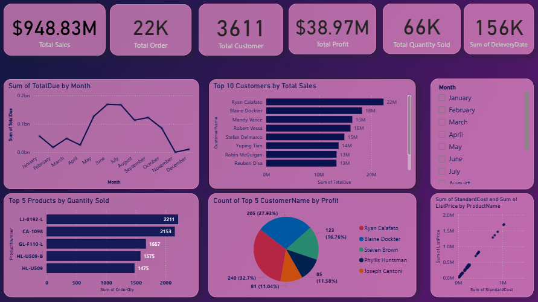

# 🧾 Sales Analysis Dashboard - Power BI

### 📌 Objective
Analyze sales performance across regions and customer types to identify growth opportunities.

### 🧹 Data Cleaning
Performed using Python (Pandas) — removed duplicates, handled missing values, and standardized date formats.

### 📊 Tools Used
- Python (Pandas, Matplotlib)
- Power BI for visualization

### 📈 Insights
- Region X has the highest sales.
- Repeat customers represent 70% of total sales.

### 📸 Dashboard Preview

